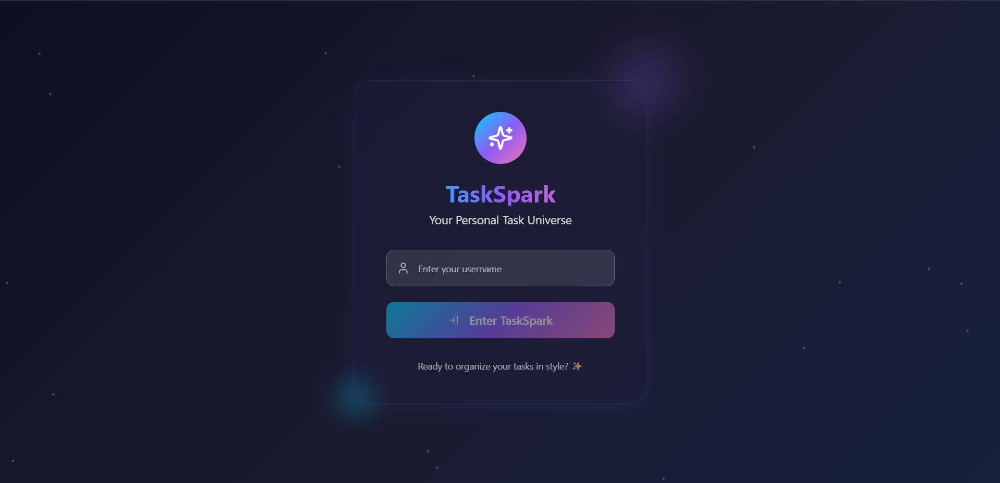
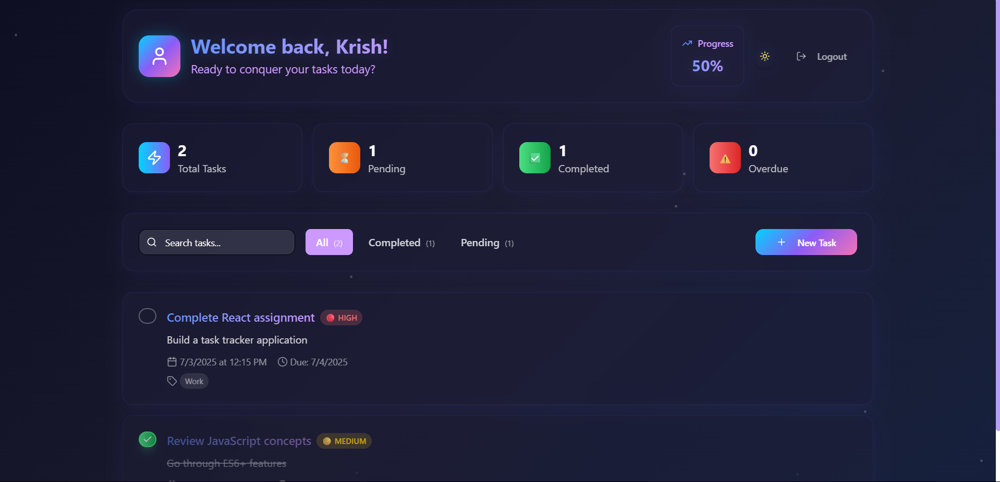

# Personal Task Tracker

## 📖 Description
A modern, responsive personal task management app built with React. Easily add, edit, delete, and filter your tasks. Features include search, priorities, due dates, categories, dark mode, and smooth animations.

## 🚀 Features
- Simple login (username only, stored in localStorage)
- Add, edit, delete, and complete tasks
- Inline editing and custom delete confirmation
- Task filtering: All, Completed, Pending (with counts)
- Search tasks by title, description, or category
- Task priorities (High, Medium, Low)
- Due dates and categories/tags
- Data persistence with localStorage
- Responsive design (mobile & desktop)
- Dark mode toggle
- Smooth animations and modern UI

## 🛠 Setup Instructions
1. Clone the repository
2. Run `npm install`
3. Run `npm run dev`
4. Open [http://localhost:8080](http://localhost:8080)

## 🧰 Technologies Used
- React.js (functional components & hooks)
- Tailwind CSS
- TypeScript

## 🔗 Live Demo
(https://task-spark.vercel.app/)

## 🖼 Screenshots



---

## 📦 Project Structure
```
task-tracker/
├── public/
│   └── index.html
├── src/
│   ├── components/
│   │   ├── Login.tsx
│   │   ├── TaskForm.tsx
│   │   ├── TaskItem.tsx
│   │   ├── TaskList.tsx
│   │   ├── TaskFilter.tsx
│   │   └── SearchBar.tsx
│   ├── contexts/
│   │   └── ThemeContext.tsx
│   ├── types/
│   │   └── Task.ts
│   ├── App.tsx
│   └── index.tsx
├── README.md
└── package.json
```

## 🧪 Sample Data
```js
const sampleTasks = [
  {
    id: 1,
    title: "Complete React assignment",
    description: "Build a task tracker application",
    completed: false,
    createdAt: "2024-01-15T10:00:00Z"
  },
  {
    id: 2,
    title: "Review JavaScript concepts",
    description: "Go through ES6+ features",
    completed: true,
    createdAt: "2024-01-14T15:30:00Z"
  }
];
```

## 🧠 Evaluation
- Clean, readable code
- Responsive, user-friendly UI
- All core and bonus features implemented
- No external state management
- LocalStorage for persistence
- Well-structured and documented
